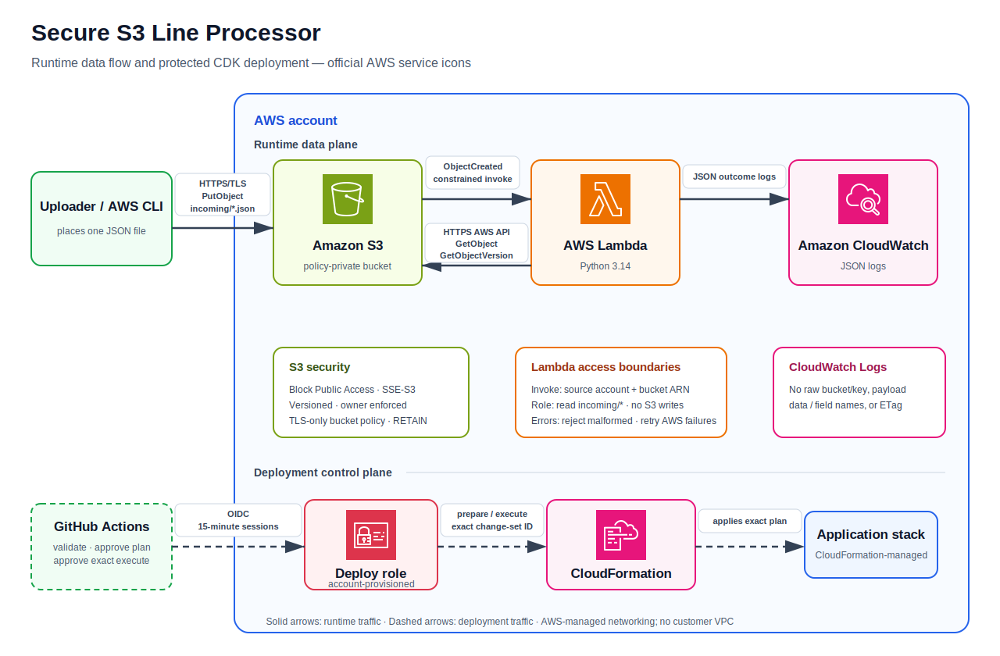

# Secure S3 Line Processor

A compact AWS CDK v2 application that accepts one-line JSON objects in a
private S3 bucket and validates them with a Python Lambda function. The design
is intentionally direct: S3 invokes Lambda without a queue, database, VPC, or
custom framework.



The editable source is [docs/architecture.excalidraw](docs/architecture.excalidraw).

## How it works

1. An uploader sends a file to `incoming/*.json` over HTTPS.
2. S3 emits an object-created notification to Lambda.
3. Lambda URL-decodes the key and requests the exact object version when the
   event includes a version ID.
4. Lambda checks reported and returned lengths, then reads at most 1 MiB plus
   one byte.
5. The function validates UTF-8, the one-line contract, valid JSON, and a
   top-level object.
6. It logs safe structured metadata to CloudWatch Logs.

Every record in a notification is processed. Permanent input errors are logged
as `rejected` and do not cause retries. S3 access failures, missing objects,
service errors, and unexpected failures are logged with safe context and
raised so AWS can retry them. S3 notification test events are logged and
ignored without attempting an object read.

## Input contract

Accepted objects must satisfy all of these rules:

- The key begins with `incoming/` and ends with `.json`.
- The object is no larger than 1 MiB.
- The content is UTF-8. A UTF-8 byte-order mark is accepted.
- The file contains exactly one non-empty logical line.
- One trailing `\n` or `\r\n` is allowed.
- The line contains one valid JSON object.
- The top-level JSON value is an object/dictionary.
- Uploaded `Content-Type` metadata is not trusted as format proof.

Empty, whitespace-only, invalid UTF-8, malformed, pretty-printed, multiline,
top-level array, primitive, boolean, and null inputs are rejected.

Valid input:

```json
{"event_id":"example-001","message":"hello","source":"manual-test"}
```

The `samples/` directory includes valid, malformed, and multiline examples.

## Security decisions

- S3 Block Public Access is fully enabled, ACLs are disabled through
  bucket-owner-enforced ownership, and website hosting and CORS are absent.
- SSE-S3 provides encryption at rest without introducing a customer-managed
  KMS key or its policy and cost for this small sandbox workload.
- Versioning protects against accidental overwrite and lets Lambda retrieve
  the version identified by the event instead of a later replacement.
- An explicit `DenyInsecureTransport` bucket policy denies `s3:*` over
  non-TLS connections for both the bucket and its objects.
- The bucket and its transport-security policy use `RETAIN`, so stack deletion
  does not silently remove stored data or its HTTPS guardrail.
- Lambda receives only `s3:GetObject` and `s3:GetObjectVersion` on
  `incoming/*`. It has no S3 write permission.
- The generated execution role trusts only `lambda.amazonaws.com`.
- S3 invocation permission is constrained by source bucket ARN and source
  account.
- Lambda runs outside a VPC because it only calls public AWS service APIs. A
  VPC would add networking complexity and could require NAT or endpoints
  without reducing the current attack surface.
- Logs contain object identity, size, validation status, field names, and
  field count, but never complete uploaded content or parsed values.
- Runtime IAM is separate from deployment IAM. The Lambda role reads input;
  `GitHubCdkDeployRole` deploys infrastructure and is not created here.

The bucket name is generated deterministically from the deployment account,
region, and CDK construct identity. This keeps it operator-independent and
globally scoped while allowing CloudFormation to create an inline S3
notification, a bucket-constrained Lambda permission, and exactly one Lambda
function without a circular dependency or a CDK notification custom-resource
Lambda.

## Repository structure

```text
.
├── app.py
├── cdk.json
├── lambda_src/
│   └── handler.py
├── s3_line_processor/
│   └── stack.py
├── tests/
│   ├── test_handler.py
│   └── test_stack.py
├── samples/
├── docs/
│   ├── architecture.excalidraw
│   └── architecture.svg
├── .github/
│   ├── workflows/
│   │   ├── ci.yml
│   │   └── deploy.yml
│   └── dependabot.yml
├── requirements.txt
├── requirements-dev.txt
├── package.json
└── pyproject.toml
```

Generated CloudFormation in `cdk.out/` is intentionally ignored.

## Selected versions

- AWS Lambda runtime: Python 3.14
- `aws-cdk-lib`: 2.261.0
- `constructs`: 10.7.0
- AWS CDK CLI: 2.1131.0
- Boto3 for local development and tests: 1.43.49
- Ruff: 0.15.21
- Pytest: 9.1.1
- Pytest-cov: 7.1.0
- CI Node.js: 24

These were verified as stable on July 15, 2026 using the
[Lambda runtime documentation](https://docs.aws.amazon.com/lambda/latest/dg/lambda-runtimes.html),
[PyPI](https://pypi.org/), and the
[AWS CDK CLI npm package](https://www.npmjs.com/package/aws-cdk).

The deployed function has no third-party package. It uses the Boto3 SDK in the
managed Lambda runtime. This keeps the artifact small; a larger production
system might package Boto3 to control its exact SDK version.

## Prerequisites

- Python 3.14
- Node.js 24
- AWS CLI v2 for account operations
- An already bootstrapped target account and region for deployment
- Short-lived AWS credentials from an approved non-root identity

This repository does not create root settings, IAM users, administrator
identities, `ProjectAuditRole`, `GitHubCdkDeployRole`, the GitHub OIDC provider,
CDK bootstrap roles, billing controls, Organizations, Control Tower, IAM
Identity Center, or organization policies.

## Local setup

Linux, macOS, or WSL:

```bash
python3.14 -m venv .venv
source .venv/bin/activate
python -m pip install -r requirements-dev.txt
npm ci
```

PowerShell:

```powershell
py -3.14 -m venv .venv
.venv\Scripts\Activate.ps1
python -m pip install -r requirements-dev.txt
npm ci
```

## Formatting, linting, and tests

```bash
ruff format .
ruff format --check .
ruff check .
pytest
```

Pytest is configured to report branch-aware coverage for the Lambda and CDK
packages. Tests use mocks and CDK assertions and require no AWS credentials.
Coverage is feedback rather than a perfect-percentage target.

## CDK synthesis and diff

Synthesis is local and does not require AWS credentials:

```bash
npx cdk synth
```

Diff reads the target account and requires an approved AWS session:

```bash
npx cdk diff --profile DEPLOY_PROFILE
```

Review every IAM, S3 policy, notification, replacement, and retained-resource
change before deployment.

## AWS account assumptions and audit access

The account is a standalone sandbox or workload account. Root is protected and
not used routinely. Account administration and CDK bootstrap happen outside
this repository.

For read-only inspection, first discover profile names without reading
credential files:

```bash
aws configure list-profiles
aws sts get-caller-identity --profile AUDIT_PROFILE
```

Continue only if the returned ARN represents `ProjectAuditRole`. Do not use an
administrator profile for routine inspection, and do not bypass
`AccessDenied`. If no audit profile is available, perform local validation and
leave account inspection as manual follow-up.

`ProjectAuditRole` is for read-only local inspection.
`GitHubCdkDeployRole` is for temporary GitHub OIDC deployment sessions. Neither
role is an application runtime identity.

## CDK bootstrap

Bootstrap is a one-time manual account operation and is deliberately outside
the application stack:

```bash
npx cdk bootstrap aws://ACCOUNT_ID/AWS_REGION --profile ADMIN_PROFILE
```

Use an approved non-root administrative session. Do not use
`ProjectAuditRole`, create long-lived keys, or commit account identifiers.

## Manual deployment

After bootstrap and review:

```bash
npx cdk diff --profile DEPLOY_PROFILE
npx cdk deploy --profile DEPLOY_PROFILE
```

CDK outputs the bucket and function names. Deployment and destruction are not
performed automatically by local tests.

## GitHub Actions deployment

PR CI has only `contents: read`. It formats, lints, tests, and synthesizes
without requesting an OIDC token or touching AWS.

The deployment workflow runs only through `workflow_dispatch`, requires the
`production` environment, verifies the default branch, reruns all checks,
assumes `GitHubCdkDeployRole` through OIDC, displays `cdk diff`, and deploys
without a second interactive prompt after environment approval. A production
concurrency group prevents overlapping CloudFormation deployments.

Manual GitHub prerequisites:

1. Create a GitHub environment named `production`.
2. Add environment variables `AWS_ROLE_ARN` and `AWS_REGION`.
3. Require reviewers or environment approval.
4. Protect the default branch and require CI.
5. Ensure the account is already CDK-bootstrapped.
6. Configure the existing role trust for audience `sts.amazonaws.com` and
   subject `repo:OWNER/REPOSITORY:environment:production`.
7. Keep the role trust restricted to this exact repository and environment.

Do not add AWS access keys to GitHub. The role and OIDC provider remain
account-level prerequisites and are not created by this stack.

## Uploading a sample file

```bash
aws s3 cp samples/valid.json s3://BUCKET_NAME/incoming/example.json
```

An object outside `incoming/` or without the `.json` suffix does not trigger
the function. Do not rely on `Content-Type`; the function validates bytes.

## Viewing logs

```bash
aws logs tail /aws/lambda/FUNCTION_NAME --since 10m --follow
```

A successful log entry includes `status: processed`, object metadata,
`parsed_field_count`, and `top_level_fields`. A permanent invalid input has
`status: rejected` and a safe `reason_code`. Operational failures are raised
after safe context is logged.

## Maintenance

Dependency updates:

- Dependabot opens small weekly grouped PRs for pip, npm, and GitHub Actions.
- CodeRabbit provides advisory review; CI remains authoritative.
- Keep exact pins and regenerate `package-lock.json` with `npm install` after
  changing the CDK CLI.
- After every update, run Ruff, Pytest, `npx cdk synth`, and an authenticated
  `npx cdk diff`.

Read-only inspection after confirming `ProjectAuditRole`:

```bash
aws s3api get-public-access-block --bucket BUCKET_NAME --profile AUDIT_PROFILE
aws s3api get-bucket-encryption --bucket BUCKET_NAME --profile AUDIT_PROFILE
aws s3api get-bucket-versioning --bucket BUCKET_NAME --profile AUDIT_PROFILE
aws s3api get-bucket-ownership-controls --bucket BUCKET_NAME --profile AUDIT_PROFILE
aws s3api get-bucket-policy --bucket BUCKET_NAME --profile AUDIT_PROFILE
aws lambda get-function-configuration --function-name FUNCTION_NAME --profile AUDIT_PROFILE
aws cloudformation describe-stacks --stack-name S3LineProcessorStack --profile AUDIT_PROFILE
```

Update both `docs/architecture.excalidraw` and `docs/architecture.svg` whenever
components or flows change, then confirm the README export still matches the
editable source.

## Cleanup

Review the current stack diff, then destroy application resources:

```bash
npx cdk diff --profile DEPLOY_PROFILE
npx cdk destroy --profile DEPLOY_PROFILE
```

CDK removes the Lambda, log group, and stack-managed resources, but the
versioned bucket and HTTPS-enforcing bucket policy remain because they use
`RETAIN`.

Removing a visible object does not remove older versions or delete markers.
Inspect and explicitly remove every retained version before deleting the
bucket:

```bash
aws s3api list-object-versions --bucket BUCKET_NAME
aws s3api delete-object --bucket BUCKET_NAME --key OBJECT_KEY --version-id VERSION_ID
aws s3api delete-bucket --bucket BUCKET_NAME
```

Repeat `delete-object` for all versions and delete markers. Confirm the bucket
name and target account before any destructive command.

## Known limitations

- S3 notifications are at-least-once and can arrive out of order.
- Duplicate processing is harmless today because the processor only logs.
- Invalid files are not quarantined; they remain in the retained input bucket.
- There is no DLQ, replay queue, output store, or cross-record transaction.
- One operational failure raises the invocation so AWS can retry.
- The maximum object is intentionally small and read into memory after a
  bounded read.
- The generated bucket naming scheme permits one copy of this stack per
  account and region.

## Production considerations and tradeoffs

Direct S3-to-Lambda delivery is sufficient for a small logging-only processor
and is easier to review than an event platform. A production workload might
add SQS buffering, a DLQ, idempotency storage, alarms, packaged SDK versions,
quarantine handling, or customer-managed KMS based on measured reliability,
compliance, and recovery requirements.

Those services are not implemented here because they do not help demonstrate
the requested single-file parser and would obscure least privilege and error
behavior. The current solution remains one stack, one bucket, and one Lambda,
with no VPC, NAT, API, database, queue, custom construct library, or broad
observability platform.
